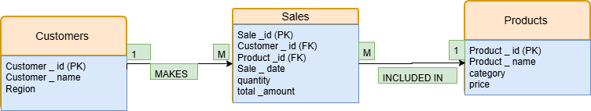

# plsql_window_functions_-28821-_-GWIRA-
PL/SQL ASSIGNMENT 1
#BUSINESS PROBLEM
##BUSINESS CONTEXT 
An online electronics store named DB ELECTRONICS selling laptops, phones, tablets, and accessories across multiple regions. The sales and marketing department wants better insights into customer behavior and product performance.
##DATA CHALLENGE 
The company struggles to identify top-selling products, track customer purchases over time, and spot patterns that can guide marketing and sales strategies.
##EXPECTED OUTCOME
•	Identify top products per region
•	Analyze customer purchasing frequency
•	Segment customers for targeted marketing
•	Track sales trends
•	Improve decisions on inventory, promotions, and regional strategies

#SCHEMA AND ER DIAGRAM 
##SCHEMA 
Customers(customer_id PK, customer_name, region)
Products(product_id PK, product_name, category, price)
Sales(sale_id PK,customer_id FK,product_id FK,sale_date,quantity,total_amount)
##ER DIAGRAM 

#JOIN QUERIES
##INNER JOIN 
(Retrieve all transactions that have valid matching customers and products)
SELECT c.customer_name, p.product_name, s.total_amount
FROM Sales s
INNER JOIN Customers c ON s.customer_id = c.customer_id
INNER JOIN Products p ON s.product_id = p.product_id;
### 

